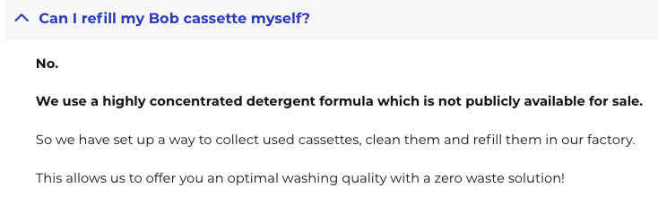
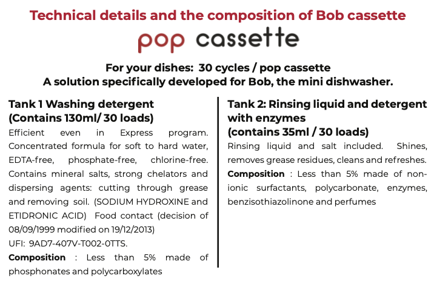
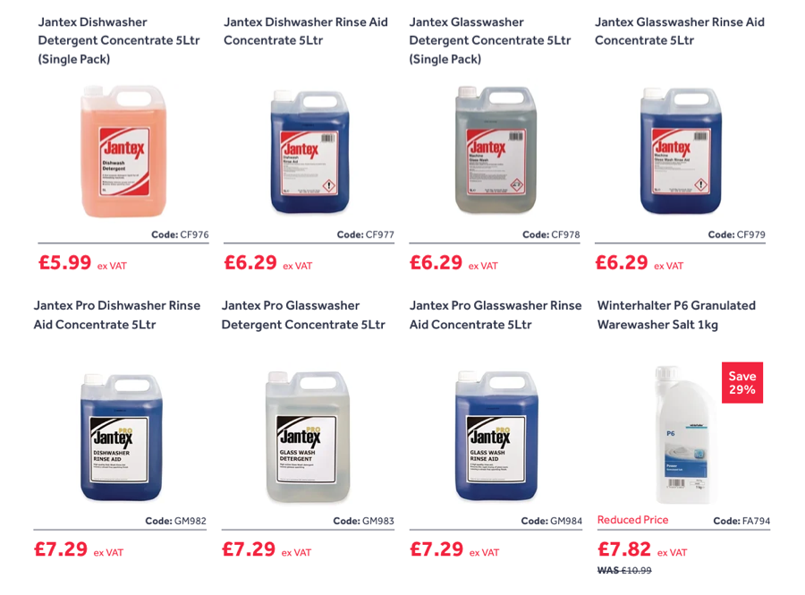
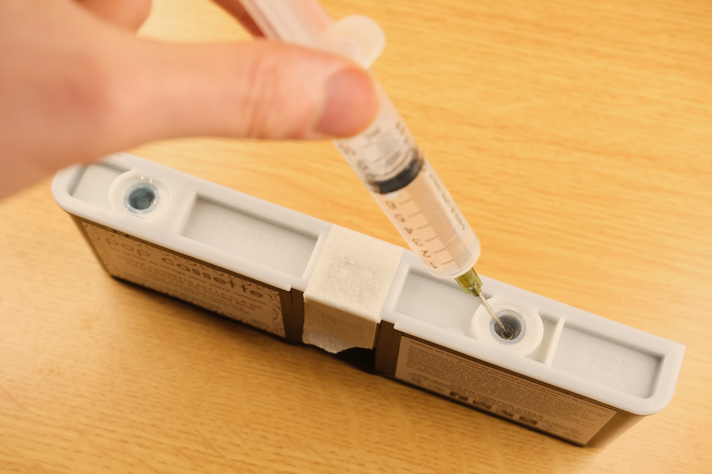
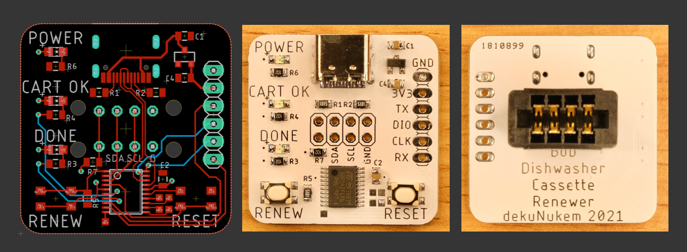
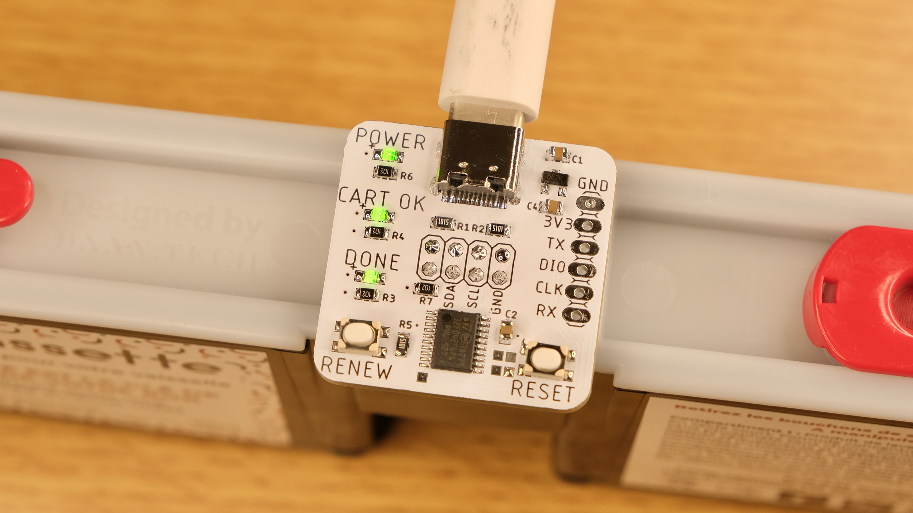

# Bob Cassette Rewinder: Hacking Dishwasher DRM for 1/75 Operating Cost

How I defeated the detergent cassette DRM of [Bob Dishwasher](https://daan.tech/en/product/bob-mini-dishwasher/), to refill it for 1/75 of the cost of buying new.

## Introduction

Back in Jan 2021, I watched Techmoan review the [Bob Dishwasher](https://www.youtube.com/watch?v=hVup5ya0WVQ) by Daan Tech. In short, Bob is a sleek and compact countertop dishwasher with a built-in water tank that can be filled by hand, requiring no plumbing and minimal space.

He seemed to be quite impressed, mentioning its ease of setup and use. I liked the idea myself too, and ordered one soon afterwards.

It arrived after a 2-months wait, and overall I'm very happy with it. It fits on my kitchen top, has enough space for my dishes, uses a tiny amount of water, and overall works just fine. No problems.

## Bob Cassettes

One of the headline features of Bob dishwasher is the [Bob Cassette](https://daan.tech/en/discover-bob-cassette/), an all-in-one detergent cartridge. Just pop it in and off you go! No need to manually measure and add detergent each wash, very convenient!

There are two types of Bob Cassettes:

### Pop Cassette

* Contains washing detergent and rinse aid

* Lasts 30 washes

### Rock’n’roll Cassette

* Contains cleaning agent and limescale remover

* Deep cleans and maintains Bob

* Should be used every 90 cycles

* Lasts 1 wash

### Advantages

Daan Tech quoted several benefits of Bob Cassettes:

* Simple to use, no need to add detergent every wash, less mess.

* Exact needed quantity is dispensed, less waste.

* 2-stage dispensing. Detergent first, rinse aid at later stage.

* Made from recycled plastic, and can be recycled again.

## Outrageous Cost

While those points are perfectly valid and I did enjoy using the cassettes, such convenience comes with a cost, and Daan Tech is more than happy to take it off your hands. Looking at [their website](https://daan.tech/en/product/compilation-pop-rock/), a 4-pack costs £29.90:

With shipping and VAT added, it costs a whopping **£43 ($60) for 90 washes**! That is 48p (67c) per wash. It might not sound like much, but it quickly adds up.

Over a year of daily washes, it would have cost **£174 ($242)** in Bob cassettes alone! Imagine paying that much recurring cost for a dishwasher!

It is clear that Daan Tech are banking on the convenience of subscription models. Now I'm sure a lot of people would have no problem with that, but personally, I can think of a few better uses of my £174 than on dishwasher detergents.

Another point to consider is what happens if they went bust? No more cassettes, and now you have a fancy paperweight, like so many silly smart appliances before it.

## Alternatives

Credit where credit's due, Daan Tech didn't completely lock down the machine with Bob cassettes. Once empty, you *can* leave it there and add detergents manually. However, they strongly suggest against this, quoting a few drawbacks:

* It's a chore to measure and add them manually at each wash.

* Dosing can be tricky, as most tablets, pods, and liquids are for full-size dishwashers.

* Muti-stage dosing impossible, can't add rise aid after main wash.

* Limescale might develop over time and damage the machine.

It is clear that this dishwasher was designed with Bob cassettes in mind, and I do enjoy their set-and-forget simplicity. That's why I made it a priority to investigate how it works.

## A Closer Look

Looking at the cassette, we can see it has a small circuit board in the middle, with 4 contacts on each side:

At the receptacle, we can see the connector for the PCB, as well as two hoses to pump out the detergent during a wash:

Notice there are only 4 wires going into the machine. Coupled with the fact that Bob needs to read the cassette to determine how many washes are left, and write to update it after a wash, I had a pretty good guess of what that mystery PCB contains.

The answer is an **I2C EEPROM**, a popular type of non-volatile memory. EEPROMs retain whatever's inside even after losing power, and are very cheap, making them perfect at holding small configuration data in embedded systems.

To settle it once and for all, I extracted the PCB from the casing by melting the plastic with a soldering iron. A bit messy, and I probably should have used a dremel, but I did't have one.

A closer look at the PCB confirmed my suspicion:

It's simply a 24C02 EEPROM with 4.7K pull-ups on I2C lines, a bypass cap, and some diodes, probably for reverse-insertion protection.

Looking at the [datasheet](resources/FT24Cxxx.pdf), 24C02 can only hold 256 *Bytes* of data, so I guess there probably isn't much going on, but we'll need to dump its contents to be sure.

## Bob the Dumper

So my plan now is to read what's inside the EEPROM. It seemed that a special connector is needed, but after rummaging around the parts bin, I found that it fits into a USB-A female socket just fine! Although I had to insulate the metal case so it won't short on the PCB contacts.

I found a leftover board from [pimping my microwave](https://github.com/dekuNukem/pimp_my_microwave), and quickly threw together a contraption to read the EEPROM:

It would just read all 256 bytes and print them over serial, and I wrote a short [Python script](/bin_dump/bob_dump.py) to save them as a `.bin` file.

Here is a quick look at whats inside a Pop cassette, with 26 washes left:

We can see that:

* Most of the EEPROM is unused (`0xff`)

* There is a UUID-like ASCII string at the beginning

* `Classique` seem indicate the cassette type

There are few other bytes here and there, I didn't know what they do, but it doesn't really matter for now. I wanted to see what changes after another wash.

So I put the cassette back, had another wash, dumped it again, and compared the difference:

Voilà, there it is! Only one byte at address `0xa1` is different, and it went down from 0x4A to 0x49 while going from 26 to 25 washes.

Doing some interpolation, it seems that byte starts from 0x4e at 30 washes, and goes down from there.

I changed it to 0x3f, which should be 15 washes, and put it back. This is what happened:

111 washes! Looks like they didn't do much bound checking 😅.

A bit perplexed, I tried several other values. In the end, it seems that the mapping is like this:

| Washes Left | Value @ 0xa1 |
|:-----------:|:------------:|
|      30     |     0x4e     |
|     ...     |              |
|      16     |     0x40     |
|      15     |     0x5f     |
|     ...     |              |
|      0      |     0x50     |

Not sure why they did it this way, but anyway!

To reset the cassette to 30 washes, all I have to do is **set that byte back to 0x4e**, easy enough!

With the simple EEPROM chip, standard 0.1 inch contacts spacing, one-byte counter, and no error checking, it sure seems Daan Tech didn't try really hard, guess they reckoned that it wasn't worth the trouble. Well, less work for me too!

## Now what?

It's great now that I can reset the Bob Cassette counter, but what should I refill it *with*? After all, this whole endeavor would be pointless if they really do have some secret sauce in there that can't be found anywhere else.

Of course, Daan Tech themselves sure wish you don't play around with the cassettes:

So what exactly *is* in those cassettes? Fortunately, they did provide some details in the user manual:

----

----

It's easy to see they kept things a bit vague to discourage loonies like me, but we can still extract some useful information out of it:

* Pop Cassette has two tanks

* Tank 1 contains 130mL of washing detergent, mainly Sodium Hydroxide (NaOH) and Etidronic Acid, less than 5% concentration.

* Tank 2 contains 35mL of rinsing liquid, also less than 5% concentration.

As the names suggest, detergent helps to break down grease and clean the dishes, while rinse aid reduces water streaking and improve drying performance. [Technology Connections did a video](https://www.youtube.com/watch?v=_rBO8neWw04) about this topic, so give it a watch!

I also wanted to find out how much detergent Bob actually uses at each stage of wash, so I did a express wash on Bob, and weighed the waste water at each stage. Its water usage is as follows:

* 1000mL washing

* 650mL to wash off the detergents

* 1200mL Rinsing

Overall, less than 3L of water for an entire load! Very efficient!

----

I can now calculate the **detergent** concentration:

* 130mL tank / 30 washes = 4.33mL per wash

* 4.33mL detergent per 1000mL water = **0.433% concentration, or 1:231 dilution**.

Similarly for **rinse aid**:

* 35mL tank / 30 washes = 1.17mL per wash

* 1.17mL rinse aid per 1000mL water = **0.117% concentration, or 1:855 dilution**.

## A Clean Getaway

With those information, I can begin searching for similar dishwasher liquids on the Internet.

I first tried "Concentrated Dishwasher Detergent", which returned a lot of supermarket dishwasher gel, not quite what I want. But it quickly led to something much more promising.

The magic word appears to be: **`Commercial Dishwasher Detergent & Rinse Aid`** from **Catering supply** websites.

A quick search showed quite a few very reasonably priced 5L detergents & rinse aids:

Of course, the question now becomes *which one do I pick?* Fortunately, all chemical products in UK comes with a `Safety Data Sheet` by regulation, which contains the composition and concentration of what's inside. This way, I can compare an unknown detergent with Bob Cassette and get a rough idea of how close it is.

Looking at the cheapest detergent (top-left), [its instruction](https://www.nisbets.co.uk/jantex-dishwasher-detergent-5-litre/cf976) states:

The dilution ratio from my earlier calculation was 1:231, right in the ballpark. Looking the data sheet:

Similar composition and concentration too! Both less than 5%.

Moving on to the cheapest [rinse aid](https://www.nisbets.co.uk/jantex-dishwasher-rinse-aid-5-litre/cf977):

Again, spot on. So there you go! Perfectly good substitutes for the detergents inside Bob cassettes.

Of course, I do realize that the chemical composition might not be 100% same, at least according to the label. But those bulk detergents are for use in professional commercial kitchens, so they are unlikely to be weak stuff. And just wait until we get to the cost analysis!

## Cost Showdown

Now comes the good part, let's work out how much I save by using bulk commercial detergents.

### Detergent

* £5.99 ex-VAT, £7.2 with VAT

* 5000mL / 4.33 mL per wash = 1154 washes

* £7.2 / 1154 = 0.62p per wash

### Rinse aid

* £6.29 ex-VAT, £7.6 with VAT

* 5000mL / 1.17 mL per wash = 4273 washes

* £7.6 / 4273 = 0.018p per wash

----

With that, the **total cost per wash** is:

0.62p + 0.018p = **0.638p**, or **1 US cent**!

We know from earlier that Bob Cassettes costs **48p (67c) per wash**.

The cost saving is absolutely staggering, refilling it yourself is **75 times cheaper**!

What's more, the 5L detergent can last well over **3 years** of daily wash, while the rinse aid can last almost **12 years**! Over those time you would have spent £2088 on Bob cassettes, and who knows if the manufacture will even be around then.

----

Of course, this calculation really is the best-case scenario, it didn't account for shipping of the bulk detergents, and they might go bad before all gets used up. But even considering those possibilities, 1 to 2p per wash should be easily achievable, which is still almost 30 times cheaper. It's a no brainer to refill your Bob Cassette if you can.

## Testing it Out

I went out and bought 2 jugs of detergent and rinse aid:

I picked them up locally, so I didn't have to pay shipping. The total came to around £17.

Refilling the cassette is easy, I taped over the PCB window to prevent liquid getting in, and injected the detergents into the cassette with a syringe with blunt needle, poking through the one-way membrane.

I then popped the cassette back, as expected, Bob reads it having full 30 washes left:

I did a wash, and the resulting dishes are just as clean as before, nothing seemed different, except I'm now paying *75 times less* for the privilege! Job done!

## Finishing Up

We are almost done! Everything's coming together, but as I will refill the cartridge frequently in the future, I do want to make a proper gadget to renew a cassette at the push of a button, instead of using the flying wire contraption earlier.

So I quickly designed a circuit board, and hand-soldered a prototype:

The board simply plugs into the cassette. When detected, `CART OK` LED will light up, and then I just have to press the `RENEW` button.

The microcontroller will reset the EEPROM, `DONE` LED will light up, and now I can refill and re-use the cassette for next to nothing!

## Conclusion and Thoughts

In this side project, I...

* Identified the chip inside the Bob cassette

* Dumped the data and figured out how to reset the counter

* Investigated alternative detergent options

* Performed cost analysis

* Did a test run with commercial detergents

* Designed a circuit board to easily renew the cassette.
