# Bob Cassette Rewinder: Defeating Dishwasher DRM for 1/30 Operating Cost

How I defeated the detergent cassette DRM of [Bob Dishwasher](https://daan.tech/en/product/bob-mini-dishwasher/), to refill it for 1/30 of the cost of buying new.

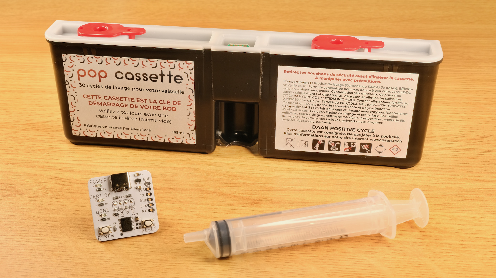

## Introduction

Back in Jan 2021, I watched Techmoan review the [Bob Dishwasher](https://www.youtube.com/watch?v=hVup5ya0WVQ) by Daan Tech. In short, Bob is a sleek and compact countertop dishwasher with a built-in water tank that can be filled by hand, requiring no plumbing and minimal space.

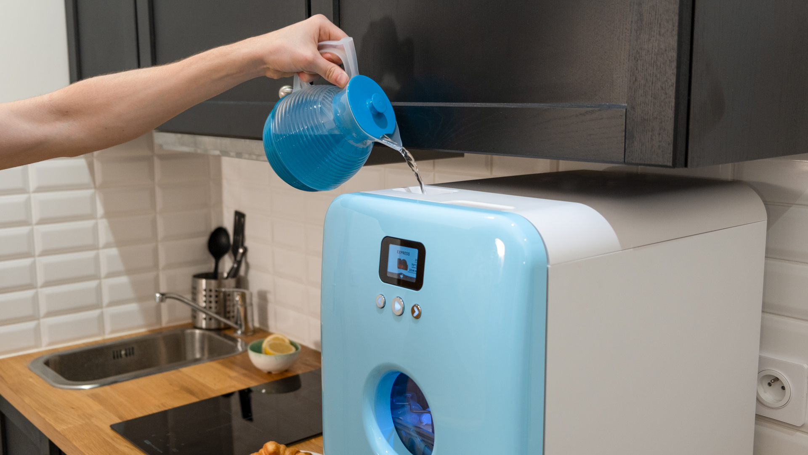

He seemed to be quite impressed, mentioning its ease of setup and use. I liked the idea myself too, and ordered one soon afterwards.

It arrived after a 2-months wait, and overall I'm very happy with it. It fits on my kitchen top, has just enough space for my dishes, and works just fine. No problems.

## Bob Cassettes

One of the headline features of Bob dishwasher is the [Bob Cassette](https://daan.tech/en/discover-bob-cassette/), an all-in-one detergent cartridge. Just pop it in and off you go! No need to manually measure and add detergent each wash, very convenient!

There are two types of Bob Cassettes:

### Pop Cassette

* Contains washing detergent and rinse aid

* Lasts 30 washes

### Rock’n’roll Cassette

* Contains cleaning agent and limescale remover

* Deep cleans and maintains Bob

* Should be used every 90 cycles

* Lasts 1 wash

### Advantages

Daan Tech quoted several benefits of Bob Cassettes:

* Simple to use, no need to add detergent every wash, less mess.

* Exact needed quantity is dispensed, less waste.

* 2-stage dispensing. Detergent first, rinse aid at later stage.

* Made from recycled plastic, and can be recycled again.

## Outrageous Cost

While those points are perfectly valid and I did enjoy using the cassettes, such convenience comes with a cost, and Daan Tech is more than happy to take it off your hands. Looking at [their website](https://daan.tech/en/product/compilation-pop-rock/), a 4-pack costs £29.90:

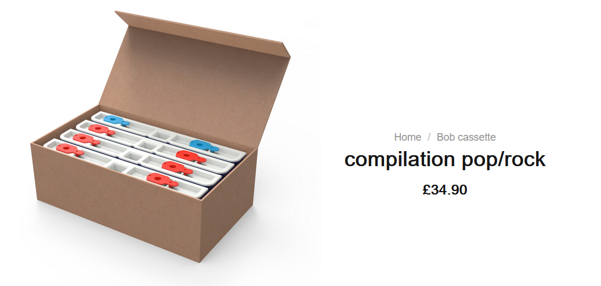

With shipping and VAT added, it costs a whopping **£43 ($60) for 90 washes**! That is 48p (67c) per wash. It might not sound like much, but it quickly adds up.

Over a year of daily washes, it would have cost **£174 ($242)** in Bob cassettes alone! Imagine paying that much recurring cost for a dishwasher!

It is clear that Daan Tech are banking on the convenience of subscription models. Now I'm sure a lot of people would have no problem with that, but personally, I can think of a few better uses of my £174 than on dishwasher detergents.

## Alternatives

Credit where credit's due, Daan Tech didn't completely lock down the machine with Bob cassettes. Once empty, you *can* leave it there and add detergents manually. However, they strongly suggest against this, quoting a few drawbacks:

* It's a chore to measure and add them manually at each wash.

* Dosing can be tricky, as most tablets, pods, and liquids are for full-size dishwashers.

* Muti-stage dosing impossible, can't add rise aid after main wash.

* Limescale might develop over time and damage the machine.

Those are all valid points as well, and I do enjoy the ease of use of the cassettes. That's why I made it a priority to investigate how it works.

## A Closer Look

Looking at the cassette, we can see it has a small circuit board in the middle, with 4 contacts on each side:

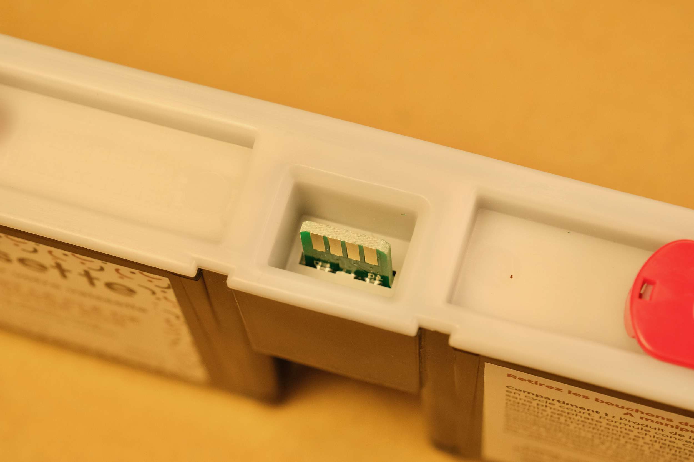

At the receptacle, we can see the connector for the PCB, as well as two hoses to pump out the detergent during a wash:

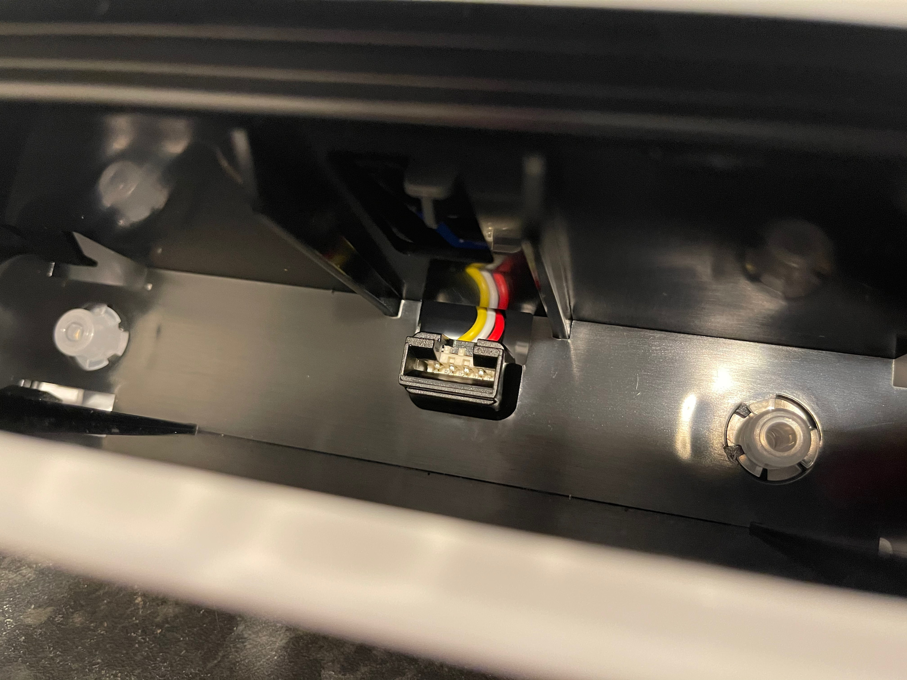

Notice there are only 4 wires going into the machine. Coupled with the fact that Bob needs to read the cassette to determine how many washes are left, and write to update it after a wash, I had a pretty good guess of what that mystery PCB contains.

The answer is an **I2C EEPROM**, a popular type of non-volatile memory that holds a small amount of information. EEPROMs retain whatever's inside even after losing power, can be very cheap, but are rather slow at writing, making them perfect to hold small configuration data in embedded systems.

To settle it once and for all, I extracted the PCB from the casing by melting the plastic with a soldering iron. A bit messy, and I probably should have used a dremel, but I did't have one.

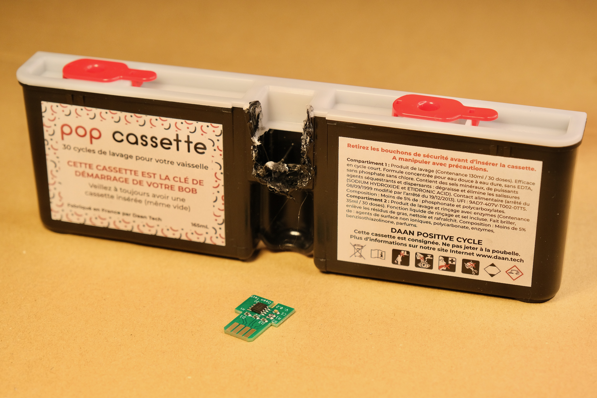

A closer look at the PCB confirmed my suspicion:

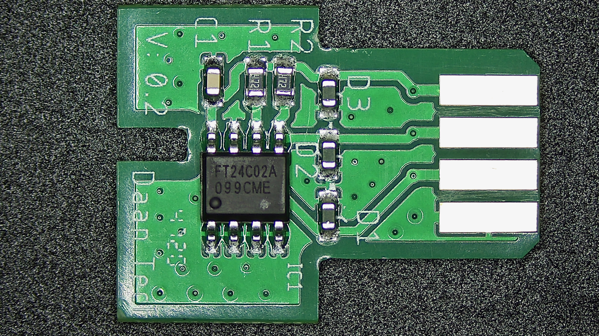

It's simply a 24C02 EEPROM with 4.7K pull-ups on I2C lines, a bypass cap, and some diodes, probably for reverse-insertion protection.

Looking at the [datasheet](resources/FT24Cxxx.pdf), 24C02 can only hold 256 *Bytes* of data, so I guess there probably isn't much going on, but we'll need to dump its contents to be sure.

## Bob the Dumper

So my plan now is to read what's inside the EEPROM. It seemed that a special connector is needed, but after rummaging around the parts bin, I found that it fits into a USB-A female socket just fine! Although I had to insulate the metal case so it won't short on the PCB contacts.

I found a leftover board from [pimping my microwave](https://github.com/dekuNukem/pimp_my_microwave), and quickly threw together a contraption to read the EEPROM:

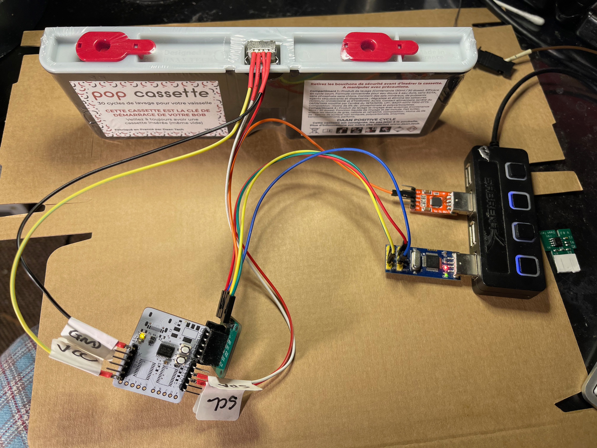

It would just read all 256 bytes and print them over serial, and I wrote a short [Python script](/bin_dump/bob_dump.py) to save them as a `.bin` file.

Here is a quick look at whats inside a Pop cassette, with 26 washes left:

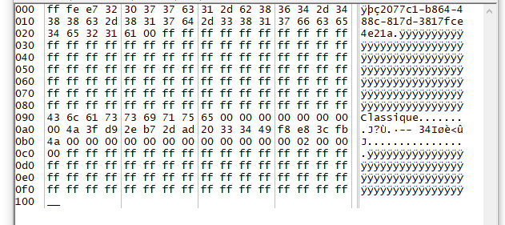

We can see that:

* Most of the EEPROM is unused (`0xff`)

* There is a UUID-like ASCII string at the beginning

* `Classique` seem indicate the cassette type

There are few other bytes here and there, I didn't know what they do, but it doesn't really matter for now. I wanted to see what changes after another wash.

So I put the cassette back, had another wash, dumped it again, and compared the difference:

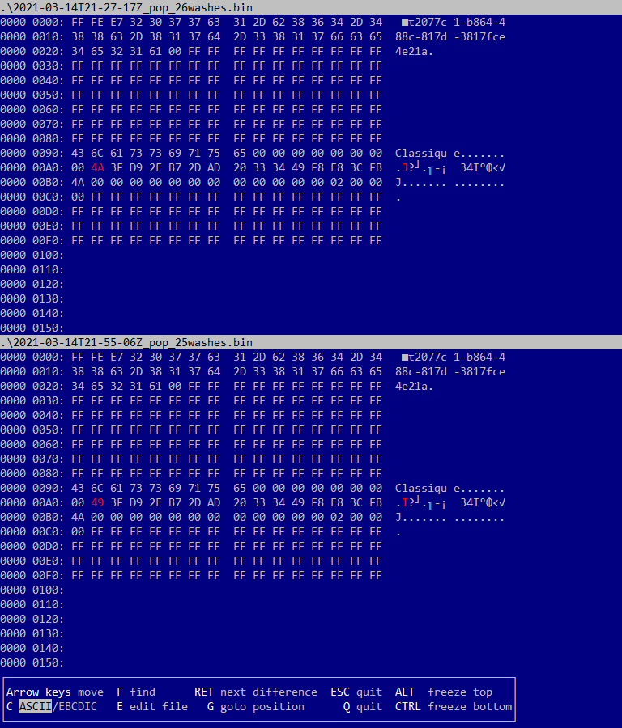

Voilà, there it is! Only one byte at address `0xa1` is different, and it went down from 0x4A to 0x49 while going from 26 to 25 washes.

Doing some interpolation, it seems that that byte starts from 0x4e at 30 washes, and goes down from there.

I changed it to 0x3f, which should be 15 washes, and put it back. This is what happened:

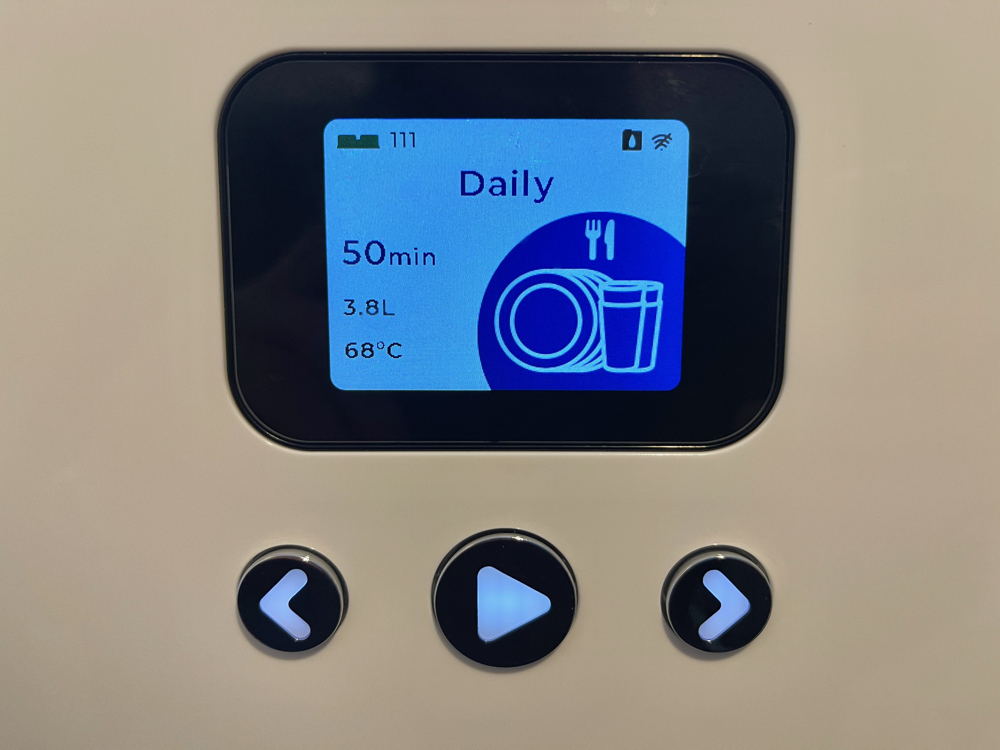

111 washes! Looks like they didn't do much bound checking 😅.

A bit perplexed, I tried several other values. In the end, it seems that the mapping is like this:

| Washes Left | Value @ 0xa1 |
|:-----------:|:------------:|
|      30     |     0x4e     |
|     ...     |              |
|      16     |     0x40     |
|      15     |     0x5f     |
|     ...     |              |
|      0      |     0x50     |

Not sure why they did it this way, but anyway!

To reset the cassette to 30 washes, all I have to do is **set that byte to 0x4e**, easy enough!

With the simple EEPROM chip, standard 0.1 inch contacts spacing, one-byte counter, and no error checking, it sure seems Daan Tech didn't try really hard, guess they reckoned that it wasn't worth the trouble. Well, less work for me too!

## Now what?

Now I can rewind the Bob Cassette and reuse it again, but 

