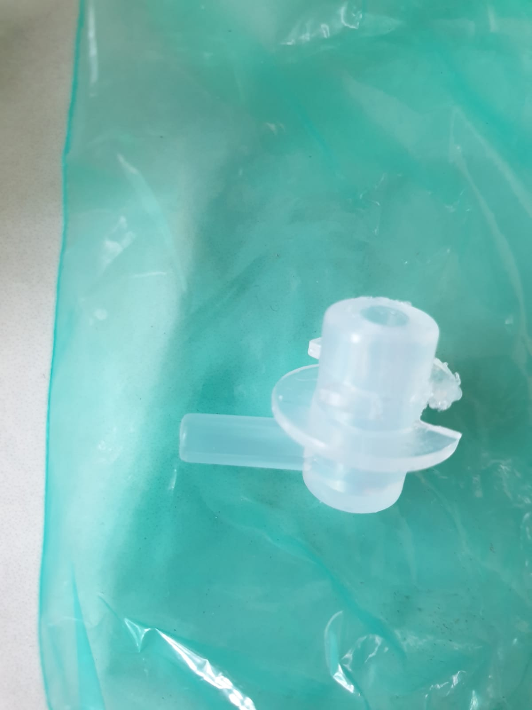
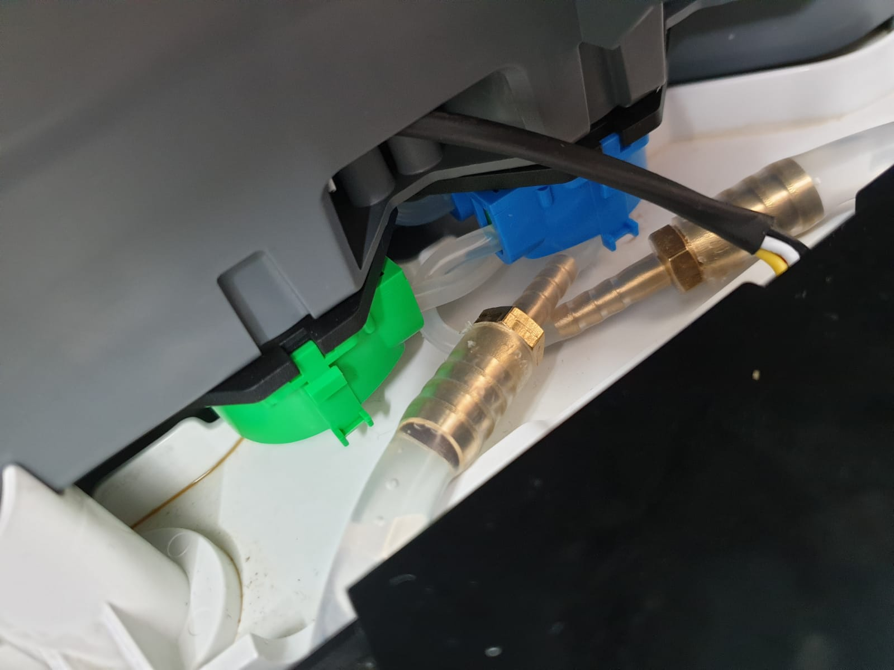
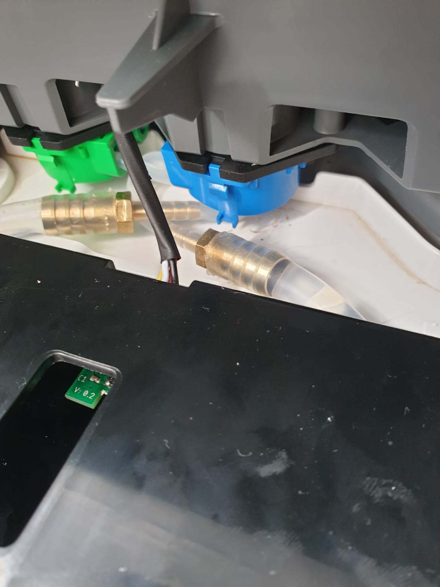
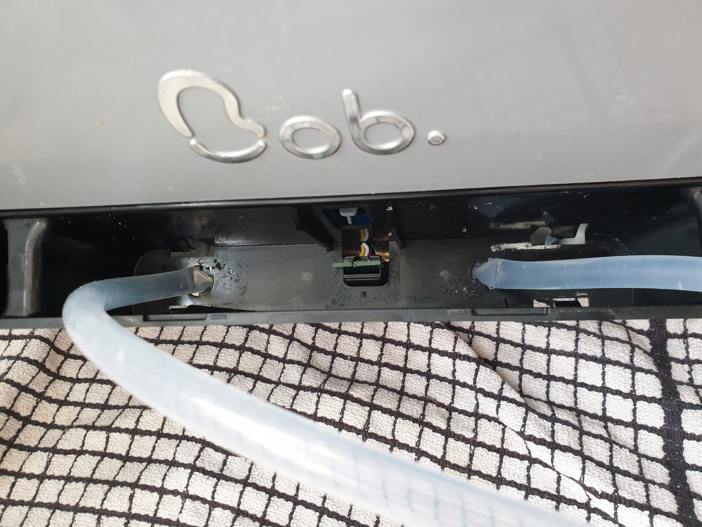
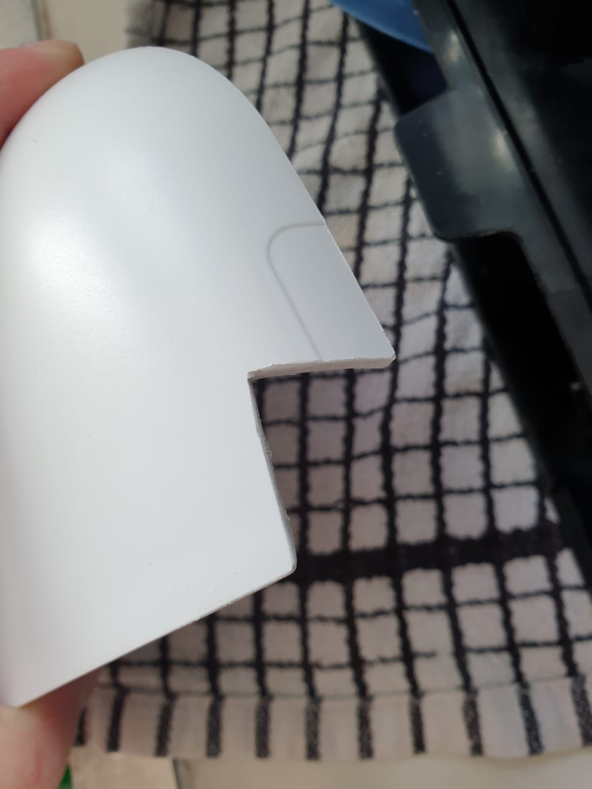
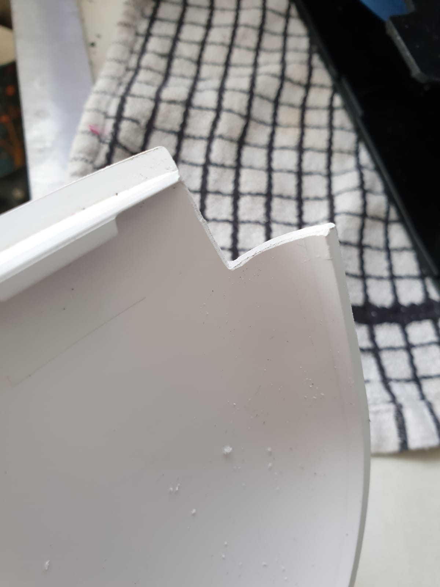
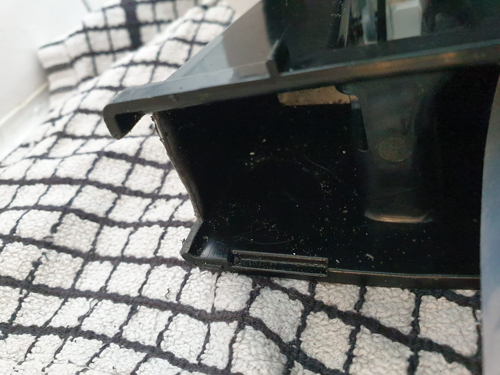
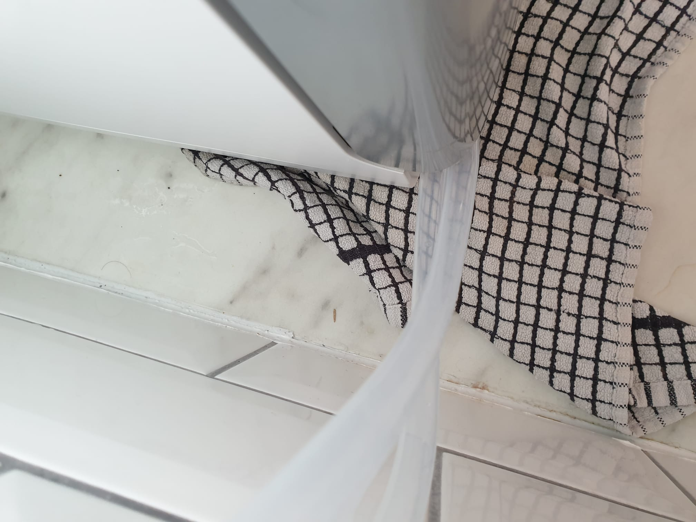
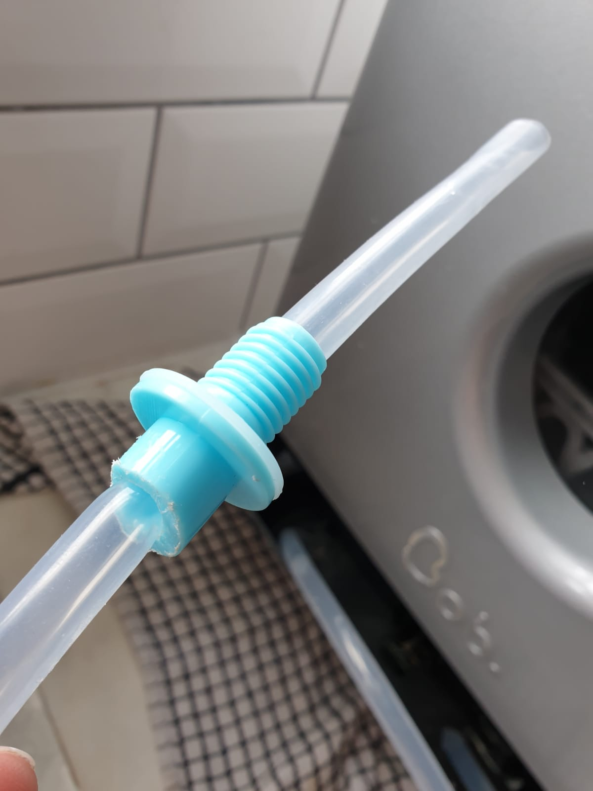
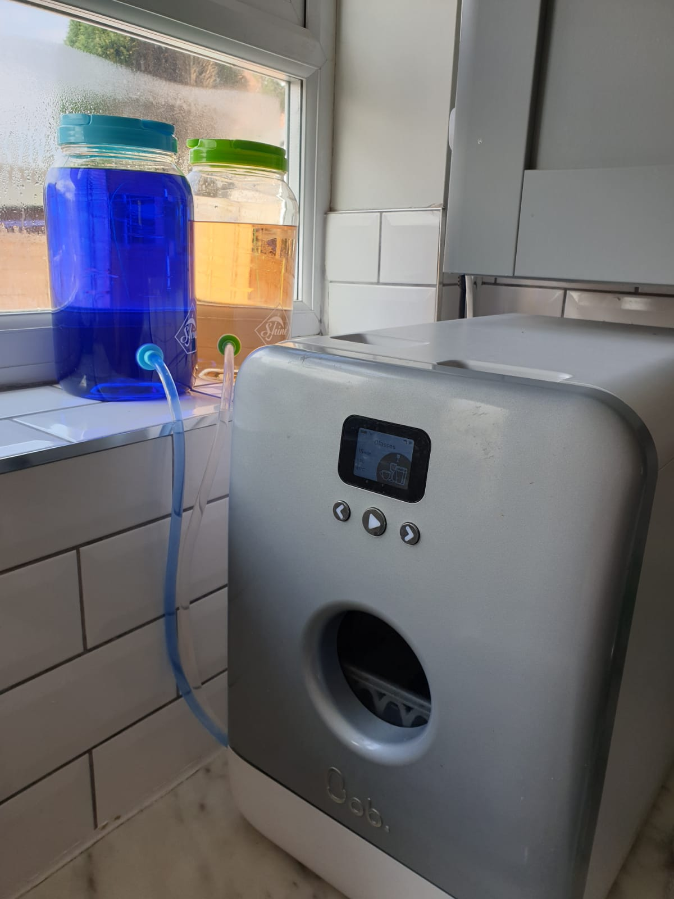

# Set up continuous feed refill

The user manual shows how to enable write protect to lock the wash count, allowing
for a continuous feed system where you don't need to refill/rewind cassettes, but does
not go into much further detail on how to set this up. I've picked up the torch
and will show in this guide how I have set up my continuous feed, and hopefully everyone
can learn from my experience and have an easier time.

⚠️**This guide goes through some destructive steps to make permanent modifications
to Bob's case, which would probably void your warranty** I have marked these specific
steps with the warning [⚠️ DESTRUCTIVE ⚠️]. It may be possible to set up a continuous
feed without these steps and smaller tubing, but I do not have personal experience,
so be warned. (If you do manage it however, please share how!)

## Materials
 - Around 2m of 8mm inner diameter x 10mm outer diameter silicon tubing.
   - Approximate cost **£6** (~£3/m).
   - Ideally the non-rigid clear silicon form as it's easiest to work with.
   - For non-destructive attempts, best try smaller, like <5mm OD.
   - I used [this](https://www.amazon.co.uk/gp/product/B07PPST52N) due
  to availability and have 3m left over.
 - 2x Straight 10mm to 4mm barb fitting hose reducers.
   - Approximate cost **£8** for brass reducers
   - If not using 10mm OD tubing above, make sure you match the reducers to your
  tubing, e.g. 5mm to 4mm. So long as one side is 4mm, to match Bob's internal tubing
   - Brass is good for the long run, although you could probably 3D print these if
  you are so inclined.
   - I used [these](https://www.amazon.co.uk/gp/product/B07ZCLPT3X)
 - 2x Mason Jars with dispenser taps.
    - Approximate cost **£10** for simple cheap ones.
    - A tap diameter of 8-10mm is ideal, as I did not need any additional sealant for
  making the pipes leak proof.
    - I used [these](https://www.amazon.co.uk/gp/product/B071681BHR)

## Tools
 - Junior Hacksaw
 - Scissors
 - Needle nose pliers
 - Small file

## 1. [Enable Write protect on a cassette EEPROM](user_manual.md#can-i-enable-write-protect-wp-to-lock-out-wash-count)

## 2. Remove the front cassette tray
This is fairly easy, there is one larger tab on the top of the black tray (right
hand side) which keeps it from swinging out too much. Simply open the door slightly,
and gently bend out the bottom of the door frame while pulling on the tray, it should
'snap' out to a near horizonal angle.

Then you can unhinge the draw, by shifting it to the right (the two pegs which hold
the tray on slot in to the left). There should be a clear plastic guard at the bottom
and you should see the two small tubes going from the tray to the pumps, as well as
the cassette chip reader. The tubes are 'locked' into the tray via the custom connectors
(which extract the detergent from the cassettes). Simply rotate the underside of
the connectors to unlock and pull them out. This can be a bit tricky, so possibly
use a set of needle nose pliers. The chip reader is held on at the back by a tiny
metal clip. I recommend taking this off last as the thin silicon tubes are far more
easily broken by stretching, than the more hardy wires.

## 3. Replace the connectors with the reducers
With the tray removed, you should be able to see the two pumps which draw controlled
amounts of detergent and rinse aid into Bob from the cassette. The Green (left) draws
detergent, the Blue (right) draws the rinse aid, from opposite sides of the cassettes
via 3mm ID x 4mm OD silicon tubing.

Carefully remove the tray connectors from the tubes. They are only held on by pressure
fit, and can be replaced by reducers, and connected to the larger continuous feed tubes.

The connectors look like this:

Once the reducers have been fitted, it should look something like:

It's best to keep as much slack as possible in the small tubes, which is why I have
inverted my setup, so the detergent is pulled from the left tray hole, and rinse aid
from the right.

## 4. [⚠️ DESTRUCTIVE ⚠️] Feed the tubes out of Bob
Now we have a solid feed from long 10mm tubes, we want to feed them through the tray
to the external tanks. These tubes nicely pull through the original connector holes like this:

However 10mm tubes get easily pinched by the front cover of the tray (which can be
easily unclipped) and by the bottom of the door as it swings open. To prevent this,
I cut a small section from the top of the tray and the plastic cover using the junior
hacksaw, and filed them smooth with the small file:

Once the tray is put back on, and the tubes are kept roughly horizonal, these cuts
give the tubes just the clearance they need when opening the door:

If you do not wish to make these permanent modifications, it could be possible to
use smaller diameter feed tubes and keep the front tray cover off. So long as the
tubes are the same or wider diameter than the 4mm internal tubes, the pumps should
not have too much strain trying to pull from them.

## 5. Prepare the feed tanks
We want to feed Bob detergent and rinse aid from large, external tanks. I used two
plastic mason jars, intended to dispense party drinks. These had annoyingly square
taps, but these were easily cut off by a junior hacksaw.

The Bob cassettes primarily feed by gravity, as the small pumps are mainly used to
measure precise amounts of detergent for the washes, so you need to set up the tanks
in a higher position than Bob. You could even put the tanks directly on top of the
unit, however this could get awkward if you are manually filling with water, and
potentially dangerous if the rising steam after a wash damages the pipes.

I ran the feed tubes through the taps like so:

## 6. Connect the tanks and test it out!
Now we have pretty much everything in place, connect the tubes to the tanks, ensuring
a good water-tight seal. I recommend having the feed tube sit in the tank and rest at
the bottom, so the magical physics of siphoning can allow it to be emptied lower than
the level of the tap on the side. Insert the write-protected board removed from the
cassette into the tray, and fill the tanks with water and perform a test run. The
highly-concentrated detergent is nasty stuff to clean up in case of a leak.

I have noticed Bob does have an on-board counter which decreases after a wash cycle.
My cassette is frozen at 16 washes, but after using it once, the display will decrease
to 15. This is not written to the EEPROM, as turning Bob off and on again or re-reading
the chip will display 16 again, so don't panic when it appears to be going down.

If all goes well and your setup is leak proof, fill your tanks up with the
[recommended](user_manual.md#buy-replacement-detergents) detergent/rise aid and
enjoy care-free continuous feeding!

My completed setup:

