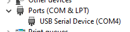
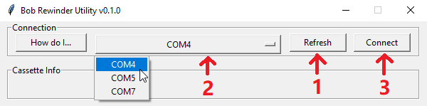
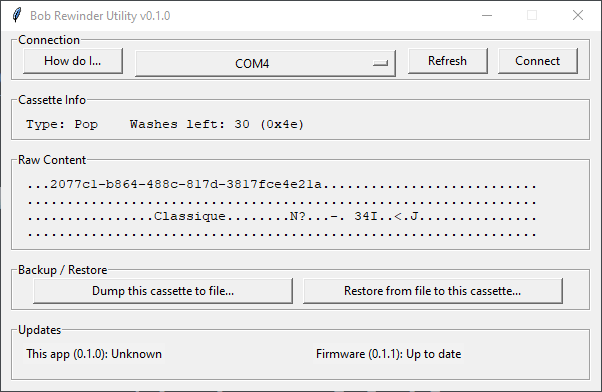
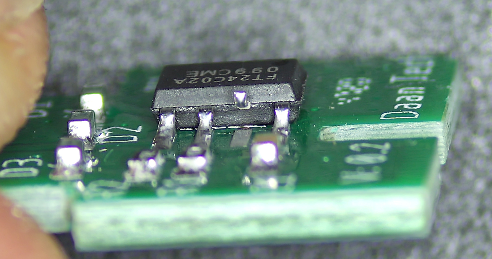
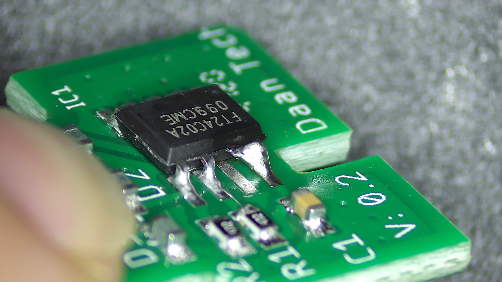

# Bob Cassette Rewinder User Manual

[Get Bob Rewinder](https://www.tindie.com/products/23316/) | [Official Discord](https://discord.gg/gyGFqD2vfP) | [Main Page](README.md)

---

Welcome to your very own Bob Rewinder! Here's how to renew and refill your Bob Cassette.

## Table of Contents

[Using Bob Rewinder](#go-offline)

[Bob Rewinder Utility](#using-bob-rewinder-utility)

[EEPROM Write Protect](#can-i-enable-write-protect-wp-to-lock-out-wash-count)

## Discord Chatroom

Feel free to join our [discord server](https://discord.gg/gyGFqD2vfP) for latest announcements and discussions! I'll be around to help any questions you have.

## Go Offline!

First of all, **disconnect your Bob from WiFi**!

There is precisely ZERO reason why a dishwasher should be online, and now the cat's out of the bag, they might very well push an OTA update to make this harder.

So go into the *Settings* menu and **disconnect it now!** If you're not sure, do a factory reset.

## Buy Replacement Detergents

You'll need to buy some detergents AND rinse aid in order to refill the cassette.

The magic word seems to be **`Commercial Dishwasher Detergent & Rinse Aid`** from **Catering supplies** store/websites.

Read the product description and find out its **recommended usage**.

### DETERGENT Recommended Dosage

It should be suitable for Bob Cassette if **`ANY`** of those criteria is true:

* Around or less than 4.33mL per 1L water

* Around or less than 0.433% concentration

* Around or more than 1:231 dilution

### RINSE AID Recommended Dosage

It should be suitable for Bob Cassette if **`ANY`** of those criteria is true:

* Around or less than 1.17mL per 1L water

* Around or less than 0.117% concentration

* Around or more than 1:855 dilution

### Examples

To get you started, here is a website with [a lot of good candidates](https://www.nisbets.co.uk/cleaning-and-hygiene/cleaning-chemicals/detergent-and-rinse-aid/_/a33-3). You don't have to buy from them, it's just an example.

The recommended dosage of the [cheapest one](https://www.nisbets.co.uk/jantex-dishwasher-detergent-5-litre/cf976) is this:

300 is a bigger number than 231, so this one should work fine.

----

Let's take a look at [another detergent](https://www.nisbets.co.uk/jantex-pro-dishwasher-detergent-5-litre/gm981):

2.5mL is less than 4.33mL, so it should work as well. Bob will pump 4.33mL detergent per wash regardless, so in this case it will add a bit more than needed.

---

[Rinse aid](https://www.nisbets.co.uk/jantex-dishwasher-rinse-aid-5-litre/cf977) is a similar story:

This one says 1.25mL, Bob pumps 1.17mL rinse aid per wash, so just about right!

---

Regardless, it should cost around £7-10 each. You'll save more on local pickup, so check your local catering supply stores first!

Here's what I got:

## Reset the Bob Cassette

When your Bob Cassette is empty, remove it from the machine, wipe off any liquids, and insert the Bob Rewinder as shown:

Note the orientation! You should insert it with the **`label on the cassette facing you`**:

Plug in the USB cable. The `POWER` and `CART OK` LEDs should light up. If they don't, you might have inserted it the wrong way.

Press the `RENEW` button, the `DONE` LED should light up, and now the cassette has been reset!

## Refill the Bob Cassette

Word of warning before we start, since we will be working with concentrated detergents, it is very important to **be careful** and wear protective gears such as **latex gloves and safety glasses!**

If you do get it on your skin, rinse immediately and consult the safety data sheet.

---

Also take note of which goes in which:

With label facing you, rinse aid goes into **LEFT** tank, detergent goes into **RIGHT** tank.

---

To start...

* Get your syringe ready, preferably with a thick blunt needle.

* A bigger syringe would mean less repeats, I find 30mL just about right.

* [⚠️IMPORTANT] **Tape off the opening** for the connector so liquid won't get inside.

* Otherwise any spill will corrode the chip and render the whole cassette useless.

* Pour the detergent into a **wide-top container** so it can be easily drawn up with the syringe.

* Draw the liquid into the syringe

* Lightly poke though the one-way membrane, preferably **at dead centre and straight down**

* Slowly inject into the tank

* Repeat until full

* Wash the syringe and do the other tank

Better to **keep it slow at first** until you get hang of it.

Wipe off any spills, remove the tape and insert the cassette back in. 

**Start a new wash** or **power cycle Bob**, it should recognise the cassette as full again. Happy dishwashing at 1/60 cost!

## What about Rock'n'Roll Cassette?

Rock'n'Roll contains a cleaning agent in the big compartment, and limescale remover in the small compartment. You can probably refill it with regular detergents and limescale remover liquid. 

Bob Rewinder works with Rock'n'Roll Cassettes, and will reset it just fine.

## Using Bob Rewinder Utility

A simple PC app is available to dump / restore the content of your Bob Cassettes.

### Find the COM Port

**`Right click`** on the start button, then select `Device Manager`:

Insert Bob Rewinder into a cassette, and plug it into your computer with a USB-C cable.

In the `Ports (COM & LPT)` section, A new `USB Serial Device` should appear.

Remember the number! **`COM4`** in this case. Yours might be different.

### Download the Application

[Head here to download the latest release](https://github.com/dekuNukem/bob_cassette_rewinder/releases/latest).

* The software is in early stages of development. If you run into any problems, please don't hesitate to [open an issue](https://github.com/dekuNukem/bob_cassette_rewinder/issues), ask in the [official discord](https://discord.gg/gyGFqD2vfP), or contact me through `dekuNukem`@`gmail`.`com`.

### "Untrusted App" Warning

Launch the app by clicking **`bob_util.txt`**.

Your system might complain about this software being untrusted. This is because I haven't had the code digitally signed, which costs hundreds of dollars a year.

Please feel free to [review the code](https://github.com/dekuNukem/bob_cassette_rewinder/tree/master/pc_app). If you don't trust the app, you can also run `bob_util.py` script directly in Python3.

Click `More info` and then `Run anyway`.

### Dump / Restore Bob Cassettes

After the app has launched, press `Refresh` button, select the COM port with the correct number, and press `Connect`.

If everything goes well, it will read the cassette and display its content:

You can then dump the cassette content to a file, or restore from a file to the cassette.

Top tip: You can change the cassette type by restoring a corresponding EEPROM dump to it! For example, if you restore a Rock'n'Roll dump to a Pop cassette, it will become a R'n'R cassette and you can refill it and use it as such!

[Here are some sample dumps that you can use](https://github.com/dekuNukem/bob_cassette_rewinder/raw/master/bin_dump/sample_bins.zip)

## Can I enable Write Protect (WP) to lock out wash count?

Yes! But not very easy to do.

By enabling Write Protect (WP), the memory chip will no longer accept any writes, effectively freezing the wash count. This is useful if you want to modify your Bob to use continuous feed of detergents from external tanks.

To do it, you'll need to:

#### Extract the PCB from a cassette

* Make sure it has some washes left!

* You can cut it out with a dremel, or melt the plastic with a soldering iron:

* Be careful not to damage it!

* The PCB should look like this:

#### Modify the Write Protect (WP) Pin

When WP pin is connected to GND (or not connected at all), write protect is disabled.

When WP pin is connected to VCC, write protect is enabled.

On the PCB, WP is connected to GND. We'll need to disconnect it, and hook it up to VCC instead.

The easiest way is to **melt the solder** on the WP pin, and **gently lift it up** off the pads so it is no longer making contact:

Then, **gently** bend it towards the VCC pin, and bridge them together with a bit of solder:

That's it! Insert the PCB into Bob **component side up**. The wash count will now be frozen, and you can use Bob for as long as you like!

## Questions or Comments?

Please feel free to [open an issue](https://github.com/dekuNukem/bob_cassette_rewinder/issues), ask in my [discord server](https://discord.gg/gyGFqD2vfP), DM me on discord `dekuNukem#6998`, or email `dekuNukem`@`gmail`.`com` for inquires.
