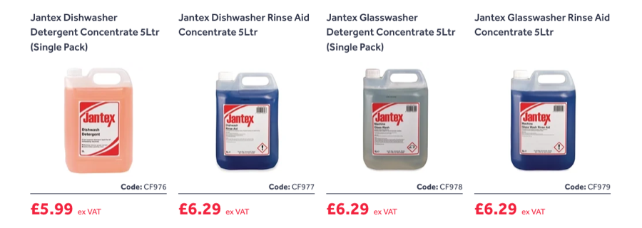
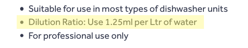
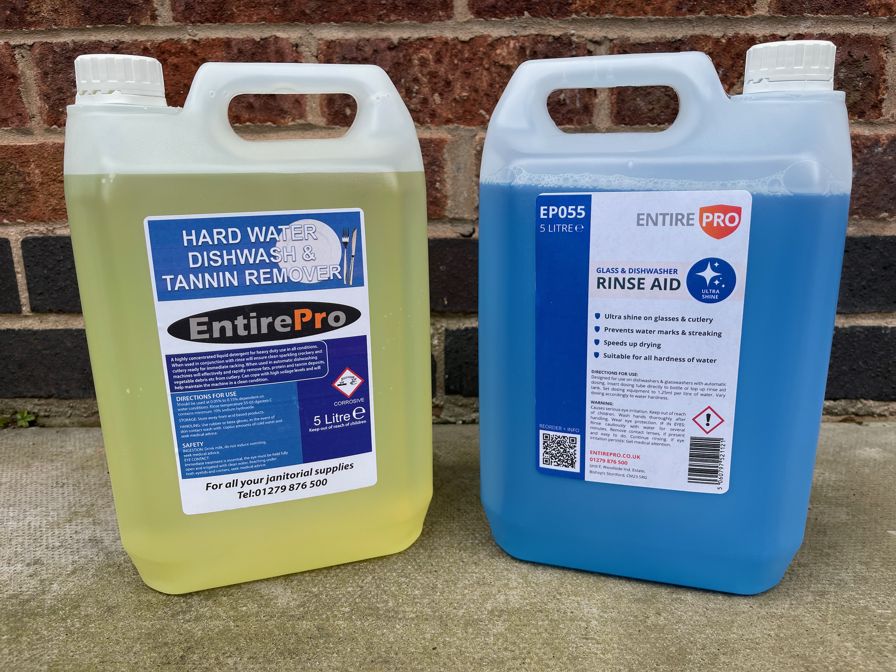
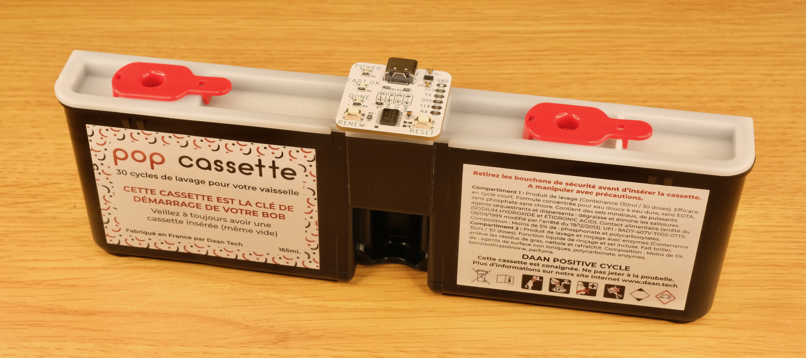
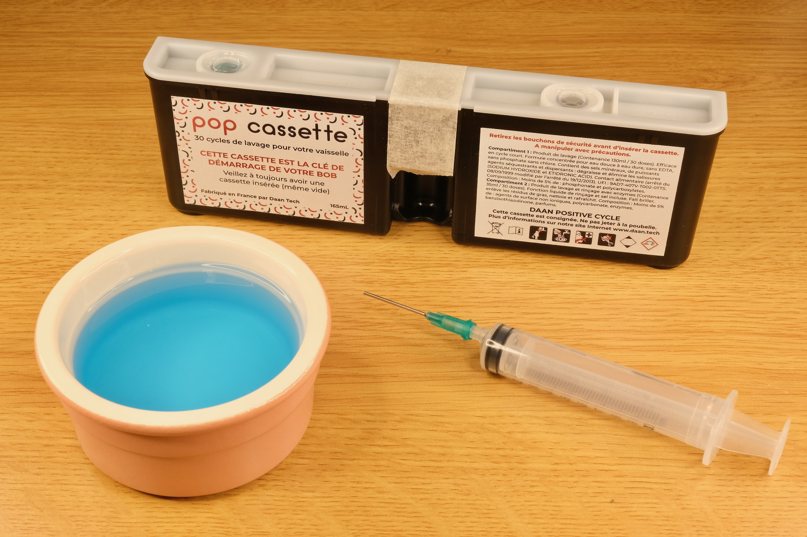
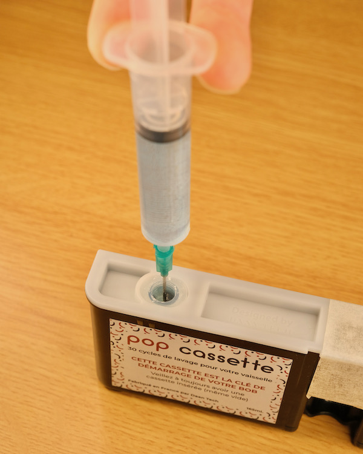
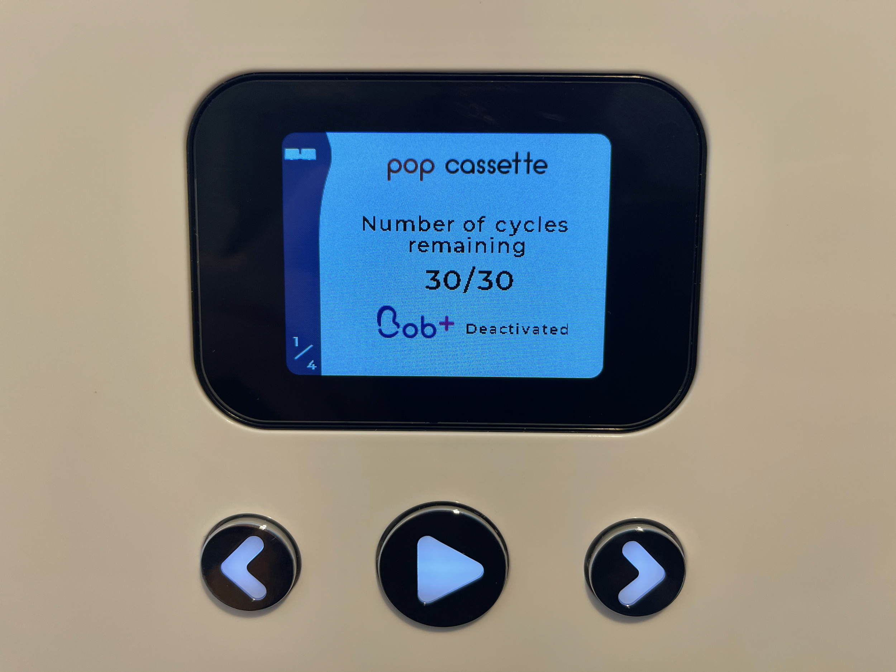

# Bob Cassette Rewinder User Manual

[Get Bob Rewinder](https://www.tindie.com/products/23316/) | [Official Discord](https://discord.gg/gyGFqD2vfP) | [Main Page](README.md)

---

Welcome to your very own Bob Rewinder! Here's how to renew and refill your Bob Cassette.

## Discord Chatroom

Feel free to join our [discord server](https://discord.gg/gyGFqD2vfP) for latest announcements and discussions! I'll be around to help any questions you have.

## Go Offline!

First of all, **disconnect your Bob from WiFi**!

There is precisely ZERO reason why a dishwasher should be online, and now the cat's out of the bag, they might very well push an OTA update to make this harder.

So go into the *Settings* menu and **disconnect it now!** If you're not sure, do a factory reset.

## Buy Replacement Detergents

You'll need to buy some detergents AND rinse aid in order to refill the cassette.

The magic word seems to be **`Commercial Dishwasher Detergent & Rinse Aid`** from **Catering supplies** store/websites.

Read the product description and find out its **recommended usage**.

### DETERGENT Recommended Dosage

Is should be suitable for Bob Cassette if **`ANY`** of those criteria is true:

* Around or less than 4.33mL per 1L water

* Around or less than 0.433% concentration

* Around or more than 1:231 dilution

### RINSE AID Recommended Dosage

It should be suitable for Bob Cassette if **`ANY`** of those criteria is true:

* Around or less than 1.17mL per 1L water

* Around or less than 0.117% concentration

* Around or more than 1:855 dilution

### Examples

To get you started, here is a website with [a lot of good candidates](https://www.nisbets.co.uk/cleaning-and-hygiene/cleaning-chemicals/detergent-and-rinse-aid/_/a33-3). You don't have to buy from them, it's just an example.

The recommended dosage of the [cheapest one](https://www.nisbets.co.uk/jantex-dishwasher-detergent-5-litre/cf976) is this:

300 is a bigger number than 231, so this one should work fine.

----

Let's take a look at [another detergent](https://www.nisbets.co.uk/jantex-pro-dishwasher-detergent-5-litre/gm981):

2.5mL is less than 4.33mL, so it should work as well. Bob will pump 4.33mL detergent per wash regardless, so in this case it will add a bit more than needed.

---

[Rinse aid](https://www.nisbets.co.uk/jantex-dishwasher-rinse-aid-5-litre/cf977) is a similar story:

This one says 1.25mL, Bob pumps 1.17mL rinse aid per wash, so just about right!

---

Regardless, it should cost around £7-10 each. You'll save more on local pickup, so check your local catering supply stores first!

Here's what I got:

## Reset the Bob Cassette

When your Bob Cassette is empty, remove it from the machine, wipe off any liquids, and insert the Bob Rewinder as shown:

Note the orientation! You should insert it with the **`label on the cassette facing you`**:

Plug in the USB cable. The `POWER` and `CART OK` LEDs should light up. If they don't, you might have inserted it the wrong way.

Press the `RENEW` button, the `DONE` LED should light up, and now the cassette has been reset!

## Refill the Bob Cassette

Word of warning before we start, since we will be working with concentrated detergents, it is very important to **be careful** and wear protective gears such as **latex gloves and safety glasses!**

If you do get it on your skin, rinse immediately and consult the safety data sheet.

---

Also take note of which goes in which:

With label facing you, rinse aid goes into **LEFT** tank, detergent goes into **RIGHT** tank.

---

To start...

* Get your syringe ready, preferably with a thick blunt needle.

* A bigger syringe would mean less repeats, I find 30mL just about right.

* **Tape off the opening** for the PCB so liquid won't get inside.

* Pour the detergent into a **wide-top container** so it can be easily drawn up with the syringe.

* Draw the liquid into the syringe

* Lightly poke though the one-way membrane, preferably **at dead centre and straight down**

* Slowly inject into the tank

* Repeat until full

* Wash the syringe and do the other tank

Better to **keep it slow at first** until you get hang of it.

Wipe off any spills, remove the tape and insert the cassette back in. Bob should recognise it as full again. Happy dishwashing at 1/75 cost!

## Questions or Comments?

Please feel free to [open an issue](https://github.com/dekuNukem/bob_cassette_rewinder/issues), ask in my [discord server](https://discord.gg/gyGFqD2vfP), DM me on discord `dekuNukem#6998`, or email `dekuNukem`@`gmail`.`com` for inquires.
